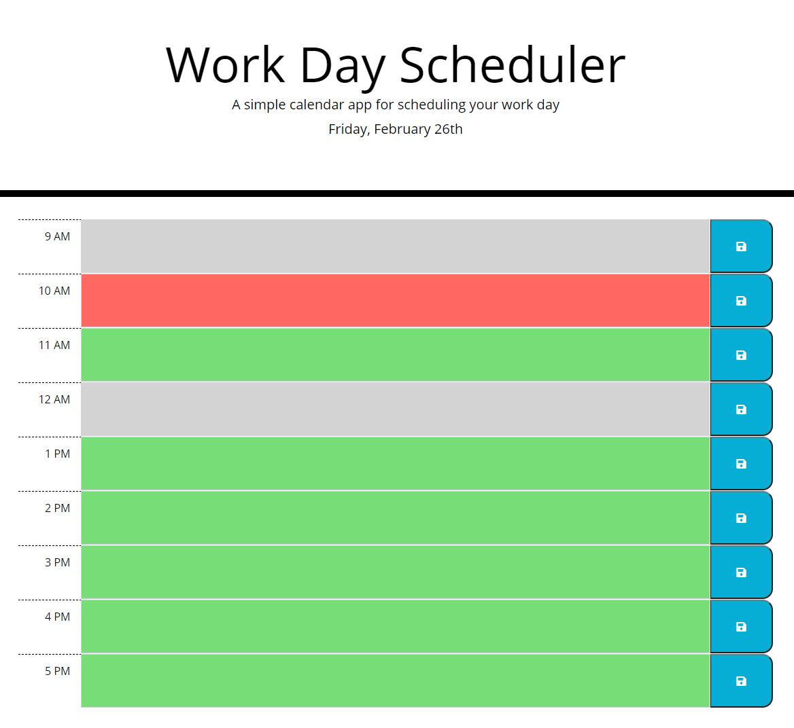

# Scheduler

## Description

Using a standard business daily planner to create a schedule that displays the current day.
Each time block is color-coded to indicate the past, present, or future. 
You can enter event, click save, and after refreshing page saved event stays. 

## Website

https://tessaustin.github.io/scheduler/

## Screenshot

